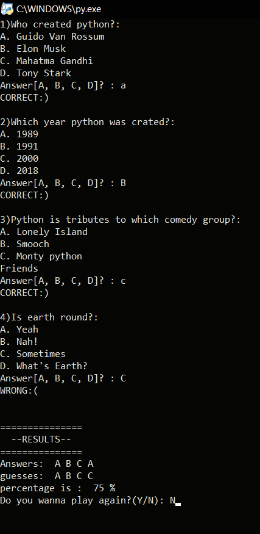

# ❓🥴 Quiz_Game

Quiz_game is a simple program to display MCQ based questions.

## 🚀 Features

- 👤 Devolopers can add their own questions, options, answers.
- 🗨 user can view questions, answer them and view score based on their performance
- 📬 Operations Involved:
  - 📁 dictionary,list.
  - 🔄 while loop,for loop.
  - 📝 functions and information flow between functions.

## 🛠️ Main Technologies

- `Python`🐍

## 📝 Process

Upon learning about lists and dictionaries in Python, I had the idea of creating some projects based on them.

So I created a program that will show users, multiple-choice questions and options from which they can choose answers.  If they answer it correctly, their score will be incremented, and if they answer wrong, their score will be decreased. The answer key and their result percentage will be given to the user after the test.

## 🐛 Current Bug

So far, I'm not really sure if there are any bugs.I have already handled some known bugs. However, there may be some issues, Please let me know if you found any bugs.

<h3> 📸 - Demo Images </h3>

#

